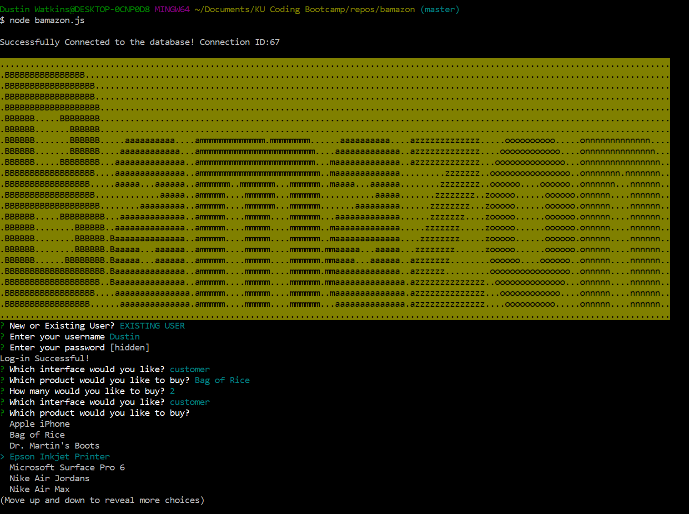

# bamazon

## Synopsis

* [Video Walkthrough](link/link.link)

Bamazon is a command line app using node and MySQL.
Bamazon is an Amazon-like storefront that takes in orders from customers and depletes stock from the store's inventory. 
There are three user interfaces: customer, manager, and supervisor, each having different abilities.   

## Code Example
node bamazon.js

## Motivation

This was created as a project for KU Coding Bootcamp

## Installation

Fork the repo and clone.  Then in command line run node bamazon.js

## API Reference

* [Moment](https://www.npmjs.com/package/moment)

* [DotEnv](https://www.npmjs.com/package/dotenv)

